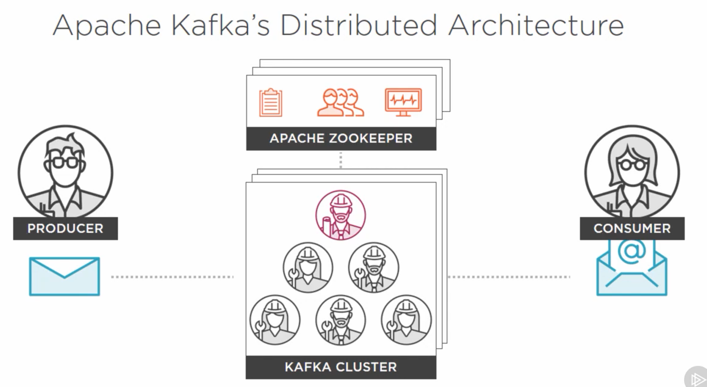

# Kafka Architecture

It is a pub-sub messaging system. Publishers (called as Producers in Kafka) creates some data (also known as message) to a specific location and interested and authorized Subscribers (called as Consumers in Kafka) retrieve the message and process it. 
These publishers and subscribers are simple application that implement publishing and consuming APIs. 
Topic is a collection or grouping of messages and has specific name (defined upfront or on-demand) and form. The location where Kafka keep / maintains topics is called Broker. 
Broker is a software process (more precisely a daemon service). It has access to resources on which it is running. For example, file system where it may be storing its messages in logical grouping under Topics.

## The Apache Kafka Cluster
Distribute workload. Scale broker. How
Cluster is a group of brokers in one or more machines. One or more brokers can be on a single machine. It is important to understand how independent grouping of brokers are which propels the horizontal scalability in a fault-tolerant way.

### Principles of Distributed system
A system is a collection of resources that are instructed to achieve a specific goal or function. A distributed system is collection of multiple workers or nodes. The system of nodes require coordination to ensure consistency and progress towards a common goal. Each node communicates with each other through messages. In kafka, these worker nodes are nothing but Kafka brokers. Distributed system is a hierarchy organization which controller acting as supervisor for the entire system. Controller itself is a worker node selected by other worker node to operate as controller. Controller once elected has some critical responsibility:
* Maintaining attendance: Maintaining which worker nodes are present to take on work.
* Maintaining work items: Work items are work that is committed to or assigned to workers.
* Maintaining status: On its staff and progress of workitems at hand.

Once the controller is assigned and workers are available, think of this as team is formed. The work can now be distributed. In Kafka, this team formation is the cluster and its members are brokers that have assigned themselves a controller.

Once producer create a message, it is controller's responsibility to determine which broker to service it. There are many factors which determines this - let's consider some critical one.
* Controller has to know workers availability and their health. 
* It should know what risk policy should govern its assignment. For example - Task redundancy: It needs to understand what level of redundancy it needs to employ to manage risk in case of the assign workers fails. This means that work has to be assigned to at least one more peer. To do this, controller would appoint a leader to take direct responsibility of the completion of task. It is then the leader's job to recruit its peers (per the policy) to take part in the replication. In Kafka, the risk policy to protect against data loss is known as its **replication factor**. Once peers have committed to the leader, a quorum is formed. These committed peers then take on a new role of follower to a leader. If for any reason, leader cannot find a peer to create a quorum, the controlled will pass the task to a leader who can.

We have been using the word Work. What it really means in Kafka is -
1. Receiving a message
2. Categorizing it in topic
3. Reliably persisting them for eventual consumption

In a distributed system, there are many worker nodes that consistently need to communicate with each other - this process of communication is called consensus or gossip protocol. Besides, the obvious data payloads being transferred as messages,there are other types of network communication that keep happening that keep the cluster operating normally. For example, -
* Work node membership and naming
* Receiving bootstrap configuration setting and being notified of new setting consistently in timely fashion
* Events related to selection of controller and leader
* Health status updates like heartbeat events

## Apache Zookeeper
Zookeeper can do a lot on its own but in relation to how it is being used in Kafka.
It is a centralized service for maintaining metadata about a cluster of distributed nodes. This includes bootstrap and runtime configuration information, health status, cluster and quorum group membership including the roles of elected node. Zookeeper itself is a distributed system consisting of multiple nodes in an "ensemble".

