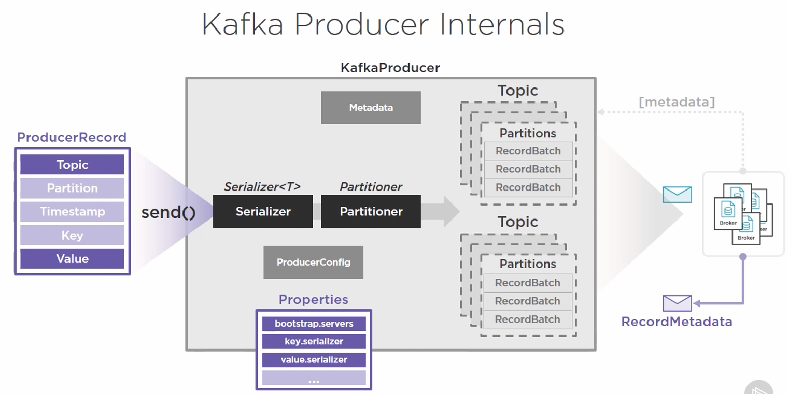
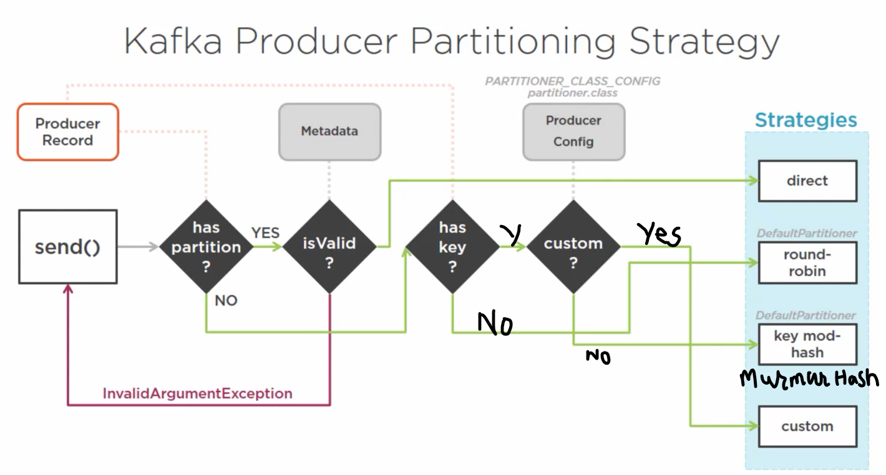

# Kafka Producers

## Architecture



## Objects

Three properties to be created:
1. Bootstrap servers: Cluster membership: partition leaders, etc.
2. Key Serializer: Classes used for message serialization and deserialization
3. Value Serializer: Classes used for message serialization and deserialization

```java
class ProducerApp {
    java.util.Properties props = new java.util.Properties();
    props.put("bootstrap.servers","BROKER-1:9092, BROKER-2:9093");
    props.put("key.serializer","org.apache.kafka.common.serializer.StringSerializer");
    props.put("value.serializer","org.apache.kafka.common.serializer.StringSerializer");
}
```

[Full list of producer config](https://kafka.apache.org/documentation.html#producerconfigs)

KafkaProducer instances can only send ProducerRecords that match the key and value serializers types it is configured with.

ProducerRecord timestamp is a Unix timestamp applied to the record. It allows for explicit setting of timestamp to the producer record. This carries with it an additional overhead of 8bytes. However, the actual timestamp that would be logged for the message will be based on setting defined in broker server.properties ```log.message.timestamp.type = [CreateTime, LogAppendTime]``` If the setting is CreateTime, producer-set timestamp is used. If it is LogAppendTime, the broker-set timestamp is used when message is appended to commit log and would override producer-set timestamp in the message.

ProducerRecord Key serves two very useful purpose - It provides additional information in the message. It strongly influences the manner in which messages are routed to the partitions it needs to be written to. Possible downside is the additional overhead which further depends on the serializer type used.

## Message Sending process
The producer will reach out the broker, the response come back as metadata containing the details related to the topic, partitions and their managing brokers. This metadata is used to create a metadata object in the producer, and it would be kept fresh throughout the producer lifetime. 

### Serialization
Additionally, a pseudo-process pipeline to first serialize the message and then a partitioner whose job is to determine to what partition to send the message to. This is where producer can implement different partitioning strategy.

### Partition Strategy



### Record Accumulation and Transmission
Now with the partition defined, the record would now be passed to in-memory ```RecordAccumulator```. ```RecordAccumulator``` is a fairly low-level object with quite a few complexity. 
At scale, efficiency is everything. This is therefore important that we do not generate overhead of pushing message one by one. This is micro-batching in Kafka comes into play. It is important to create small, fast batches of messages for sending (Producer), writing (Broker) and reading (Consumer) that can take advantage of modern day operating system functions such as ```Pagecache``` and linux ```sendfile()``` system call (kernel). By batching, the cost overhead of transmission, flushing the disk or doing network fetch is amortized over the entire batch. ```RecordAccumulator``` gives the producer its ability to micro-batch messages. This is where RecordBatch is created per TopicPartition. There are lots of advanced configurations that determine how exactly this whole accumulation works. Let's see some important ones.

RecordBatch is determined by ```batch.size``` which is max number of bytes that can be accommodated per RecordBatch. Cumulative of all the RecordBatches are ceiled by ```buffer.memory``` - this is max number of bytes that can be sent to broker in a single transmission. If the high value of buffer reaches the threshold established by ```buffer.memory``` setting, ```max.block.ms``` comes into effect. It determines how much time in ms the ```send``` method be blocked for. This blocking contingency is intended to force the backpressure on the thread producing the records. The idea is that within this block.ms, the system would be able to send batches to broker and release the buffer memory for the next set of records to be enqueued.

One of two things can happen -
* If a RecordBatch hits ```batch.size``` limit, the records are sent immediately. This is the best case scenario.
* There is another configuration called ```linger.ms``` which represents the number of millisecond the partial RecordBatch should wait before sending the data to broker.

### Guarantees

#### Delivery
Produce can specify what level of Broker acknowledgement("acks") it expects. It can be one of -
* 0: fire and forget (faster but not reliable - not recommended)
* 1: leader acknowledge (good balance of performance and reliability)
* 2: replication quorum acknowledge

Broker responds with error:
* retries
* retry.backoff.ms - how many millisecond to wait before retrying

#### Ordering
As you are now aware that message order is preserved only at partition level. There is no global order across partitions. So, if there is any ordering logic that needs to be build across partitions, it must be implemented at the consumer level or beyond. This can get complicated when errors occur especially with ```retries``` set and low ```retry.backoff.ms```. This can be mitigated with setting ```max.in.flight.request.per.connection``` as 1 - but is a tremendous performance/throughput throttling. A combination of these settings would determine message delivery semantics required by your system. It is possible to achieve one of ```at-most-once```, ```at-least-once``` and ```only-once``` assurance if appropriately designed at producer, broker and consumer level.

## Advanced topics Not covered
* Custom Serializer
* Custom Partitioner
* Asynchronous Send
* Compression Options

## Tool for testing
bin/kafka-producer-perf-test.sh