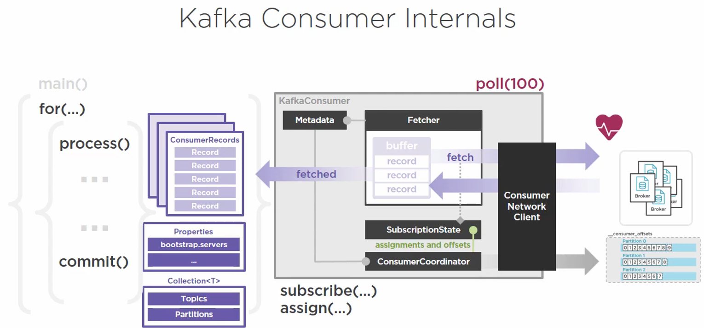

# Kafka Consumer

## Architecture



## Objects

Three properties to be created:
1. Bootstrap servers: Cluster membership: partition leaders, etc.
2. Key Serializer: Classes used for message serialization and deserialization
3. Value Serializer: Classes used for message serialization and deserialization

```java
class ProducerApp {
    java.util.Properties props = new java.util.Properties();
    props.put("bootstrap.servers","BROKER-1:9092, BROKER-2:9093");
    props.put("key.serializer","org.apache.kafka.common.serializer.StringDeserializer");
    props.put("value.serializer","org.apache.kafka.common.serializer.StringDeserializer");
}
```

## Subscription
It can be done by calling ```subscribe()``` and passing it a list of topics. For these topics, you are essentially requesting for dynamic or automatic partition assignment. This is in essence say that you are asking consumer to pull from 
* One topic, one or many partitions
* Many topics, many more partitions

Beside subscribe, there is another option - subscribing to particular partition(s). This is done through ```assign()``` which is used to subscribe to a list of ```TopicPartitions``` as below
```java
TopicPartition partition0 = new TopicPartition("myTopic", 0);
ArrayList<TopicPartition> partitions = new ArrayList<TopicPartition>();
partitions.add(partition0);
myConsumer.assign(partitions);
```

There is key difference between subscribe and assign method. By asking for specific partition, you are taking the responsibility of assigning yourself for those partitions. Once assigned these topic partitions, consumer will then start pulling the message from those partitions, regardless of topic those partitions are part of. In general, these assignments are managed for us by Kafka. As such, assign is an advanced case (Manual, self-administering mode) and must be worked carefully.

### Single Consumer Topic Subscriptions
Partition management is auto managed.

### Single Consumer Partition Assignments
If a new partition is added, it does not care.

## The Poll Loop
Primary function of the Kafka Consumer
* Poll - continuously polling the brokers for data
Single API for handling all Consumer-Broker interactions
* A lot of interactions beyond message retrieval
```java
// Set the topic subscription or partition assignments
try {
    while (true) {
        ConsumerRecords<String, String> record = myConsumer.poll(100);
        //Processing logic here
        }
    final {
        myConsumer.close()
        }
}
```

Consumer Polling - Again, please..

ConsumerCoordinator SubscriptionState

Fetcher

Consumer Network Client

ConsumerCoordinator assignment and offsets.

When the timeout expires in the poll, they are parsed, deserialized and passed into ConsumerRecords. Once the fetcher completes this process

## Message Processing
The poll() process is single-threaded operation. There is one poll loop and one thread per Kafka consumer. With all the responsibility that stems from the poll method, this may look surprising. It was designed this way mainly to keep the operations simple and to force parallelism in message consumption in another more scalable way. Once the poll method has fetched the data in form of ConsumerRecords, the consumer has to iterate through them to process them. Remember, since it is single threaded, you should be careful on what you want to process. The slowness of consumption does not really impact producers, brokers or other consumers. However, having a single consumer might not be the best idea. So, let's explore what we can do get consumption to scale.

## Offset and its management
Offset allows consumer to operate independently by maintaining the last read position from a partition within a topic. This process kicks in when poll method has timed out and records are presented to consumer for processing. **Last Committed Offset** is the definitive value of the last successfully **processed** message. Please note that we are focusing on partition here which are mutually exclusive of any other partition. As the consumer starts reading from its last committed offset, it maintains its **current position** till the last message in the partition known as the **log-end offset**. The messages from Last committed offset to the current position are still not processed fully and are known as **un-committed offsets**. There are properties that application needs to design to keep this un-committed offset under control.
* enable.auto.commit (defaulted to true) - this give Kafka the responsibility to manage when current position be marked as last committed offset. Kafka really does not know the condition in which this should happen, so it defaults its behavior on time interval which is another property as point below.
* auto.commit.interval.ms (defaulted to 5000ms). This commit would happen irrespective of whether your actual processing of the message is complete or not. In most cases, it may be fine, but it is important to understand reliability for eventually consistent system. The extent in which your system can be tolerant of eventually consistency is determined by its reliability. If your application is not reliable to the extent of your tolerance, you may end up with a system where the gap between committed position and actually processed position might never close. This may be even more complex when a) your processing failed whereas Kafka has already committed the record and changed the last committed offset, and b) where are there multiple consumers reading the same partition in a Consumer Group.

So, lets understand the offset behavior
* read != committed
* offset commit behavior is configurable - see above for ```enable.auto.commit``` and ```auto.commit.interval.ms```. Another property, ```auto.offset.rest``` (defaulted to "latest" or latest known committed offset) is used when a consumer starts to read a new partition. This property can also be set as "earliest" or "none"
* The Offset behaviour and its handled largely depends on whether your application is in a Single Consumer or Consumer Group topology.

Offsets are saves under a topic called "__consumer_offsets" (It has 50 partitions tracking these). It is the job of ConsumerCoordinator to produce the offset values to this __consumer_offset topic in the cluster via ConsumerNetworkClient. Once committed the offsets are confirmed to be committed, the ConsumerCoordinator updates the subscription state accordingly, so the fetcher can always know of last committed offset.

You can take the full control of offset management by setting ```enable.auto.commit = false```

### Manual Offset management

* CommitSync() method - This is mainly useful when higher consistency and message process fidelity is required where you do not pick up new record unless the current is committed. But do not call this within every message processing rather after the entire batch (or the for loop). In case there is a problem, CommitSync would retry and interval between retries are controlled by ```retry.backoff.ms``` (which is defaulted to 100ms).
* CommitAsync() method - 
```java
myconsumer.commitAsync() // This is not recommended because you would not know if the commit succeeded. And for obvious reason, retries are not attempted.
        
// Better alternate is to use Async with its Callback option
myconsumer.commitAsync(new OffsetCommitCallback() {
    public void OnComplete(...,...,...) { // do something }
});
```

Reasons why manual offset management may be required:
* To gain more control over Consistency
* Atomicity: Being able to treat the steps of message consumption and processing as a single atomic operation. This is an important attribute to achieve consumer delivery semantics of exactly-once vs at-least-once.

## Scaling out Consumers: Consumer Group
A consumer group is a collection of individual independent consumer processes working as a team. The only thing required to join a consumer to consumer group is to use ```group.id``` as a configuration before starting the consumer. When a consumer is a part of consumer group, the task of consuming message from the entire topic is distributed as evenly as possible - sharing both the message consumption and processing load. It can increase parallelism, throughput and provide better level of redundancy - and thus improving overall reliability and performance.

Behind the scenes, a designated broker is elected to serve as a group coordinator whose job is to monitor and maintain a consumer group membership. In addition, group coordinator works with cluster coordinator and zookeeper to assign and monitor specific partitions within a topic to individual consumers with a consumer group. From the time consumer group is formed, each consumer is sending regular heartbeat in interval as defined in ```heartbeat.interval.ms``` setting which group coordinator relies on for health check. The ```session.timeout``` setting is amount of total time a group coordinator will wait after it has not received a heartbeats before consumer is marked failed and corrective action also called **rebalance** is taken. Rebalance would kick off if a) consumer is lost, b) a new consumer is added, c) a new partition is added, etc.

### Consumer Group Rebalance
Case 1: When a partition is transferred from one consumer to another
